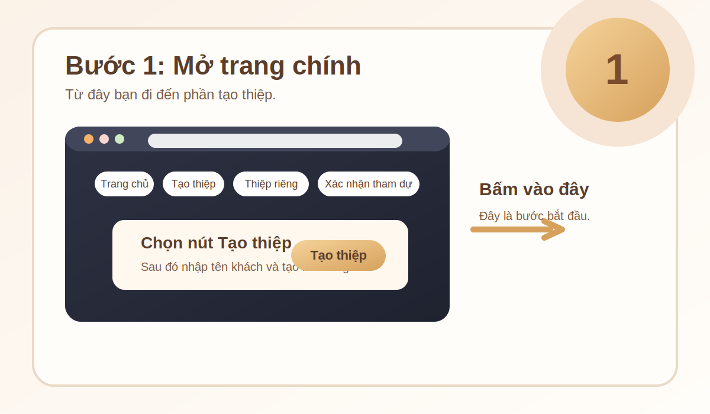
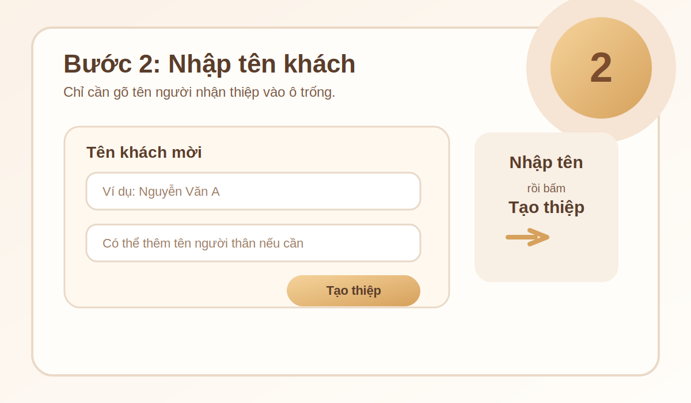
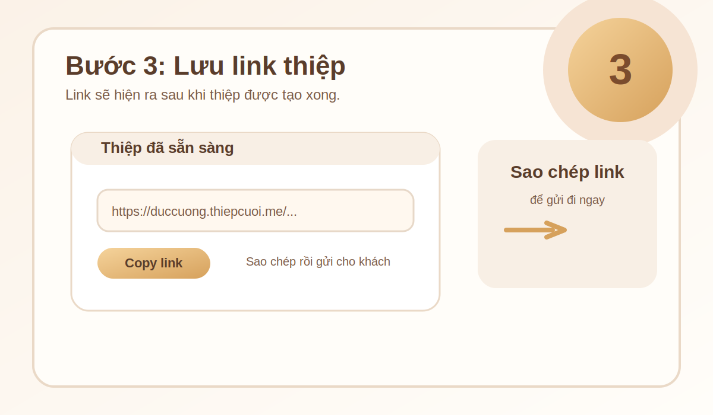
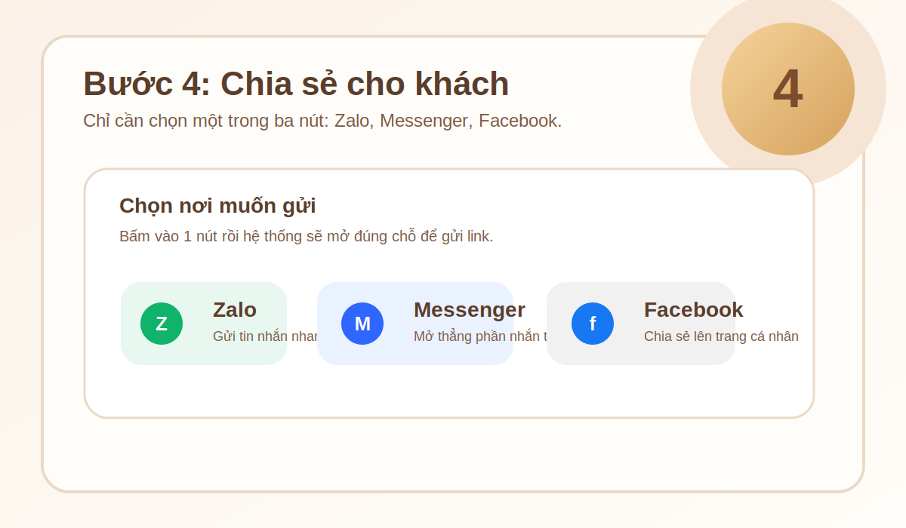
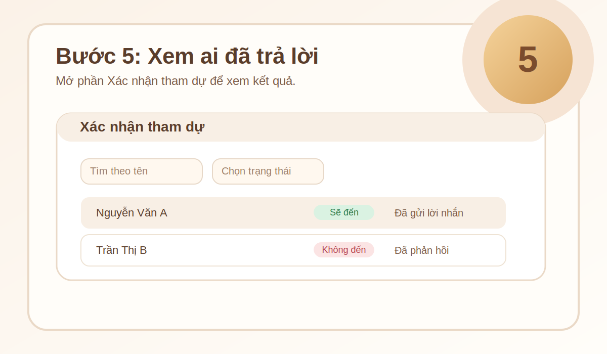

# Hướng Dẫn Sử Dụng Thiệp Cưới

Tài liệu này viết cho người dùng bình thường, không cần biết kỹ thuật.
Chỉ cần đọc từ trên xuống là có thể làm theo.

## Cách dùng nhanh bằng hình

### Bước 1: Mở trang chính

Bấm vào `Tạo thiệp` để bắt đầu.

### Bước 2: Nhập tên khách

Nhập tên người nhận thiệp rồi bấm `Tạo thiệp`.

### Bước 3: Lưu link thiệp

Khi link hiện ra, hãy sao chép lại để gửi cho khách.

### Bước 4: Chia sẻ cho khách

Chỉ dùng 3 nút này:

- `Zalo`
- `Messenger`
- `Facebook`

### Bước 5: Xem khách đã trả lời

Mở mục `Xác nhận tham dự` để xem ai đã đồng ý, ai không đến, và ai chưa trả lời.

## Các trang trong hệ thống

- Trang chính: nơi bắt đầu và đi đến các phần khác.
- Trang tạo thiệp: nơi nhập tên khách và tạo link riêng.
- Trang xem phản hồi: nơi xem ai đã trả lời tham dự.
- Trang quản lý: nơi xem danh sách khách và theo dõi thông tin cần thiết.
- Trang thiệp công khai: trang khách mở ra khi nhận được link.

## Cách chia sẻ thiệp

- Bấm `Zalo` để gửi vào Zalo.
- Bấm `Messenger` để gửi vào Messenger.
- Bấm `Facebook` để chia sẻ lên Facebook.

Chỉ cần dùng 3 nút này là đủ, không cần chọn thêm gì khác.

## Cách xem phản hồi tham dự

1. Mở trang `Xác nhận tham dự`.
2. Xem danh sách khách đã gửi phản hồi.
3. Có thể tìm theo tên hoặc xem theo trạng thái.
4. Có thể xuất ra Excel hoặc in ra giấy nếu cần.

## Nếu bạn là người cài đặt

Phần này chỉ dành cho người cần chạy dự án trên máy của mình.

1. Cài `Node.js`.
2. Mở thư mục dự án.
3. Tạo file `.env` từ `.env.example`.
4. Chạy `npm install`.
5. Chạy `npm run dev` khi đang sửa, hoặc `npm start` khi chạy bình thường.

## Lưu ý

- Mỗi khách sẽ có một đường link riêng.
- Khi đổi nội dung thiệp, nên tạo lại link nếu cần gửi lại cho khách.
- Nên mở bằng trình duyệt mới để đường link hiển thị ổn định hơn.
- Nếu trang chưa cập nhật, hãy tải lại trang một lần.
